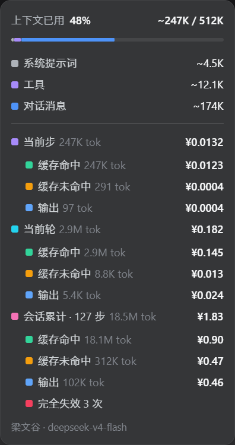

# dsh·缓存账单插件

参考 [dsh-meow-cachebilling](https://github.com/Phant0Meow/dsh-meow-cachebilling) 的思路重写，默认支持第三方中转与多级账单明细。

在上下文圆环弹层里实时算账，告诉你当前步、当前轮、整个会话各自花了多少钱，好让你知道什么时候该换窗口。

第三方中转照常记账，不限定 DeepSeek 官方路由。

## 引言

DSH 的上下文圆环是给"上下文用了多少"看的，可真正该看的是"这花了多少钱"。缓存命中率高是好事，但上下文越长，每轮带上的缓存前缀就越贵；到了换窗口的关口，旧窗口每动一次都是给缓存付费，还未必看得到数。

所以做了这个插件，把账算到明面上：当前步、当前轮、会话累计三块账，逐笔按各自时刻的峰谷费率累加，缓存命中、未命中、输出列得清清楚楚。心里有底，才知道窗口该不该换。

哦对了，这插件不挑路由——官方也罢、SiliconFlow 这种中转也罢，只要报用量，就照样记账。中转的价格表跟官方不一样时，模型名命中价目表就按估算金额显示，宁近似，不空转。

## 功能

- **第三方中转也认**：不限定 DeepSeek 官方路由，provider 非空即显示，模型名命中价目表就按估算金额计价。凭空 provider 的路由不会显示。
- **三块计时级别**：从上到下依次是当前步、当前轮、会话累计。当前步是单次 API 调用，当前轮是本轮内多步累加，会话累计带步数。每块一行标题带总额与总 token，下面缩进细列缓存命中、缓存未命中、输出三行，各带 token 数与金额。
- **会话累计**：整会话的累计花费，逐笔按各自事件时刻的峰谷费率累加，跨轮不比价。会话块还有缓存失效统计：缓存失效次数与完全失效次数，部分中转会报写入量，一并显示。
- **峰谷计价自动判定**：工作日高峰时段北京时间 09:00–12:00、14:00–18:00 按峰价，其余时段及周六日全天按谷半价。与系统时区无关，纯事件时刻换算。
- **模型分价**：V4 Flash、V4 Pro、V4 Flash Vision Exp 单价不同，按每步实际使用的模型计，vision-exp 与 flash 同价。
- **金额精度分级别**：步四位小数、轮三位、会话两位，尾零不省，便宜到 0.0001 也看得出不是零。

账单底部小字标注当前是峰价还是谷价。

## 效果

点开输入框右侧的上下文圆环，弹层底部就是账单，跟"上下文用了多少"同屏对看：



数字为示意，实际按你的用量与时刻费率计算。

```
当前步               1,100 tok  ¥0.0024
  缓存命中    800 tok      ¥0.0001
  缓存未命中  200 tok      ¥0.0006
  输出        100 tok      ¥0.0009
当前轮               2,000 tok  ¥0.0035
  缓存命中  1,700 tok      ¥0.0002
  缓存未命中  150 tok      ¥0.0005
  输出        150 tok      ¥0.0014
会话累计 · 9 步         8,550 tok  ¥0.81
  缓存命中  7,000 tok      ¥0.08
  缓存未命中  1,000 tok      ¥0.21
  输出        550 tok      ¥0.52
  缓存失效 1 次
```

## 安装

```powershell
dsh plugin --profile web add github:better-er/dsh-cache-billing
```

或安装 npm 发布的版本：`dsh plugin --profile web add dsh-cache-billing`。

一条命令装完即生效，自动挂载，重启 DSH web 后启用，无需手工编辑任何文件。

## 卸载

```powershell
dsh plugin --profile web remove dsh-cache-billing
```

彻底移除，重启 DSH web 后不再加载。

## 要求与开发

- 是**标准形态的 dsh 主机加客户端双半身插件**：host 投影层在服务端折叠事件记账，`./client` 把账单贴进官方上下文弹层。
- host 侧用 `sessionProjections` 实现：会话内的步、轮、会话累计三级账目都由投影层按事件时刻的费率逐笔核算，`apply` 返回同一引用即无变化。
- 无构建：`lib/index.js` 与 `lib/client.js` 均为源码即产物，`package.json` 声明 `dsh.client.platform: "web"`、`exports["./client"] → ./lib/client.js`，改完即用。
- 账目只认 `usage` 的 input / cacheRead / cacheWrite / output 四类 token，本地估算，实际扣费以账单为准。
- 价格、峰谷时段都写在 `src/index.ts` 的价目表里，调整后重建即可。
- 硬性约束：`lib/client.js` 的 `factory` 必须以 `return module.exports` 结尾，否则模块导出为 `undefined`，DSH 启动即 fail-loud。

## License

[MIT](./LICENSE)